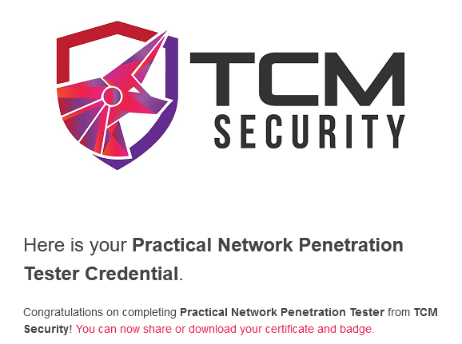

On 29th December 2024, I passed my [PNPT](https://certifications.tcm-sec.com/pnpt/) exam on my first attempt in under 24
hours. Practical Network Penetration Tester (or PNPT) for short is a cybersecurity certification provided by TCM
Security. PNPT is one of the most realistic exams on the market wherein you perform an actual network penetration test
rather than some CTF-like scenario or MCQ questions.

## About the Exam

As mentioned PNPT is a very realistic exam in the market that assesses one's ability to perform a real-world network
pentest. In this exam your task is very straightforward, all you have to do is to compromise the domain controller.
The whole course which they give along with the exam voucher is enough to clear the exam. The course is detailed and
well structured for all.

The difficulty level is subjective, but I don't think you need to be a hacking guru to be able to clear the
certification. You just have to know the basics of Linux, Networking, and Ethical Hacking and you will be good to go.

## My Background

I started my PNPT preparation back in the middle of 2024, I went through the Practical Ethical Hacking (or PEH) for
short course in the PNPT study material. I am originally from Embedded Linux background, I design PCBs and work on the
Linux Kernel and the RISC-V architecture. Cybersecurity is like a second interest for me, I like solving some Forensics,
Steganography and Hardware challenges in CTFs for fun as well as binge
on [Matt Brown's videos](https://www.youtube.com/@mattbrwn) on IoT pentesting, and thought of taking up this
certification.

I had absolutely zero idea of Active Directory and was learning from the PEH course, along with that I took up one
research
internship where I was assigned to develop an Active Directory environment which further enhanced my Active
Directory skills.

## My Preparation

For the preparation side of things, I fully completed the PEH course, External Pentest Playbook, and OSINT course. I
didn't dig deep into privilege escalation for Windows as well as Linux. I feel that these three courses are enough for
you to clear the exam as long as you are a little bit aware of the various privilege escalation strategies.

I highly recommend you to please take proper notes or follow some proper notes which I will be linking them in
the [Resources](#resources) section. Secondly, I would recommend you to follow along in all the lab exercises given
in the PEH course and practice some different scenarios as well. I also recommend solving a few HTB machines just the
first initial foothold part till you get the shell access.

## Exam Time

Enough talking! Let's dive into my experience of actually taking the exam and some useful tips that I can give along
the way :)

For the hardware setup, I started with a fresh Kali VM and ran
the [PipMyKali](https://tcm-sec.com/pimpmykali-pmk-v-2-0-release/) script to setup all the tools required for the
pentest. For the wordlists I just used [SecLists](https://github.com/danielmiessler/SecLists) and rockyou.txt for the
preparation as well as the pentest.

You don't get any initial access which you get in some other certs such as CRTP from Altered Security. Here you have to
perform external pentest and get an initial foothold and with that, you can finally enter the internal network.

One of the biggest piece of advice I can give which almost saved me from failing my first attempt is... ENUMERATE,
ENUMERATE and ENUMERATE!!!

Some steps to recover if you get stuck:

* ENUMERATE!
* Read the above step

If you are still unable to proceed further, take a break and come at it with a fresh mind. Remember this is not a CTF,
you have to think of it like a real world pentest. Just following the Navy's KISS rule (Keep It Simple Stupid). I found
myself at times diving into the CTF mindset but the path to further exploitation was directly in front of me. I
wasn't looking at it the right way. Another way to get some hints would be to watch the Case Studies in the PEH course,
yes they help!

With this, you can easily compromise the Domain Controller and become the Domain Admin.

Along your exploitation journey keep on taking screenshots even of the smallest victory as this will help you in the
report writing step, which is the most crucial step of this whole exam. Remember, the penetration test is of 5 days, but
you are given 2 whole days just for writing the report. If you don't write a professionally written report you are
likely to fail your attempt. Don't forget to watch the report writing section in PEH and you can even refer to a few
publicly available pentest reports to get an idea of how they are written. Use some specific template for writing the
report, TCM Security provides a well structured template for writing the report. At the end of the report, you have to
mention the complete path to the Domain Admin right from the external pentest to compromising the Domain Controller.

After you have submitted the report you just wait for it to get accepted and then you can finally come to the last part
of your attempt "The Debrief" Here you are given 15 minutes to showcase your findings and path to the Domain Admin, it
is a short meeting with one of the TCM Security staff. Once the staff approves your report, Congratulations! You finally
made it to the club :)

## TL;DR

Alright for the impatient ones out there! Here's the whole thing summarized:

* PNPT course has everything to pass the exam
* PEH, OSINT, and External Pentest Playbook are the most important courses
* Take proper notes
* This is not a CTF, think like a real world pentest
* Just follow the KISS principle
* If stuck, ENUMERATE, ENUMERATE, ENUMERATE...!
* Take a break and return with a fresh mind to ENUMERATE :)
* Join the TCM Security Discord community if you have some doubts (not about the exam)
* Understand what each tool does and how to use them
* Screenshot every small victory as you need it for the report
* Properly draft the pentest report
* Follow some existing templates for writing the report. TCM Security provides a really good template

## Resources

* [PipMyKali](https://tcm-sec.com/pimpmykali-pmk-v-2-0-release/)
* [SecLists](https://github.com/danielmiessler/SecLists)
* [PEH Notes](https://blog.syselement.com/tcm/courses/peh)

## Conclusion

I feel that PNPT is absolutely worth it and if you are a beginner PNPT is a great starting point in your cybersecurity
journey. I learnt a lot about hacking, approaching things with the real world perspective.
Thanks for reading!

All the best for your PNPT attempt :)

Happy Hacking
