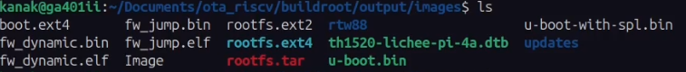
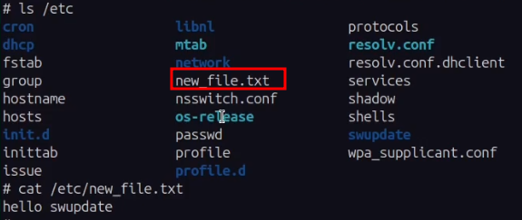

When working with embedded linux devices, implementing reliable OTA updates is crucial
for maintaining and upgrading devices remotely. In this post, I'll walk you through how I
setup SWUpdate on the LicheePi 4A using Buildroot without using any external update
managers like Hawkbit.

## Little on Buildroot

[Buildroot](https://buildroot.org) is a simple, efficient and easy-to-use tools to
generate embedded linux images using corss-compilation.
It helps in rapidly building custom Linux based environments for the embedded
systems by compiling the Linux kernel, bootloader, root filesystem and other essential
userspace packages in a streamlined manner. Buildroot is widely used for rapid prototyping
because of tis lightweight approach and ability to quickly generate images. It supports
numerous processor architectures such as ARM, MIPS, RISC-V, etc. Unlike the
[Yocto Project](https://docs.yoctoproject.org), which uses a
[layerd architecture](https://docs.yoctoproject.org/dev/overview-manual/yp-intro.html#the-yocto-project-layer-model)
using bitbake Layers, Buildroot follows a very simple approach where all the
configurations are managed through a single Kconfig file. This makes Buildroot easier to
get started with, especially for projects where customization and quick image generation
are the primary goals.

While Yocto is more flexible and scalable for large production environments with complex
dependency management, Buildroot is often preferred for smaller projects that require a
faster and more straightforward build process.

## Little on SWUpdate

[SWUpdate](https://sbabic.github.io/swupdate/swupdate.html) is a lightweight and flexible
software update framework designed for embedded linux devices. It provides a reliable way
to deploy firmware updates. SWUpdate can handle updates via various transport methods such
as HTTP, HTTPS, USB or local storage. It supports various different update strategies,
including updating live partitions, fail-safe mechanisms, and digital signature
verification for secure updates, although these mechanisms are not enabled by default and
you can configure these by following the [SWUpdate docs](https://sbabic.github.io/swupdate/signed_images.html).
From a security perspective it is highly important that you should enable encryption for
your update packages.

SWUpdate uses description files to define how updates should be applied. These files,
typically written in Lua or as a SWU meta-description file, specify the details such as
the update contents target partitions, and post-install actions.

- SWU Meta-Description File
    The `.swu` file is a CPIO archive containing the update payload and a descriptor file
    named `sw-description`. This file is a structured text file that defines the metadata,
    update contents and installation instructions.
- Lua-Based Description File
    For more complex update logic, Lua scripts can be used to define update behavior
    dynamically. This allows for conditional updates, logging, and integration with
    external services.

> **NOTE**
> I will be using SWU Meta-Description file for this post.

### SWU Meta-Description File

This is a CPIO archive and should contain the sw-description file at the start of the
archive and then the payload. If the `sw-description` file is missing or not in order,
then the SWUpdate fails.


## Building buildroot for LicheePi 4A

The default image configuration of buildroot doesn't contain SWUpdate package, you need
to enable it from *menuconfig* and selecting the **SWUpdate** package.

> **NOTE**
>
> LicheePi 4A patches are not there in the upstream buildroot. So, to build the image
> you need to clone it from my fork.
>
> ```shell
> git clone https://github.com/kanakshilledar/buildroot -b licheepi_4a_major
> cd buildroot
> make sipeed_licheepi_4a_defconfig
> make
> ```
>
> Don't forget to run `menuconfig` and select SWUpdate package.

Once the build is complete, you can find the artefacts inside the *output/images/*
directory.

Flash these artefacts to the board using fastboot.

## Performing SWUpdate on LicheePi 4A

To perform an OTA Update, as discussed before, we need to build the `.swu` file. I created
a simple file named *new_file.txt*, which contains the string "Hello, SWUpdate!"
I built the CPIO archive using the following bash script

```shell
#!/bin/bash

FILES="1-update etc etc/new_file.txt"
for i in $FILES; do echo $i; done | cpio -ov -H crc > update.swu
```

Next, I transferred the *update.swu* file via FTP, ran the `swupdate` client, and got the
file added in the `/etc` directory.


Verifying the installation via listing the file contents


## References

- [SWUpdate Documentation](https://sbabic.github.io/swupdate/index.html)
- [Buildroot Documentation](https://buildroot.org/downloads/manual/manual.html)
- [SWUpdate Best Practices](https://sbabic.github.io/swupdate/swupdate-best-practise.html)
- [SWUpdate with Buildroot Talk](https://youtu.be/8vv5Xf6dBKE)

## Conclusion

SSWUpdate is a flexible tool for managing OTA updates on embedded Linux devices. In this
setup, I performed a simple file update using SWUpdate on the LicheePi 4A. However, adding
arbitrary files into the filesystem is not a good idea. Here, I added a file purely as a
proof of concept. Please refer the [SWUpdate best practies](https://sbabic.github.io/swupdate/swupdate-best-practise.html)
page for further details.

Thanks for reading :)
