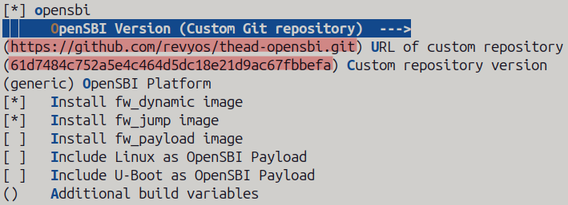
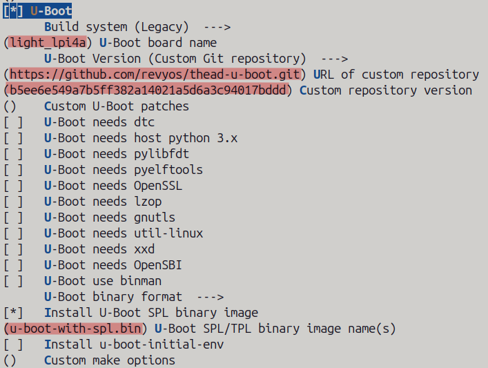
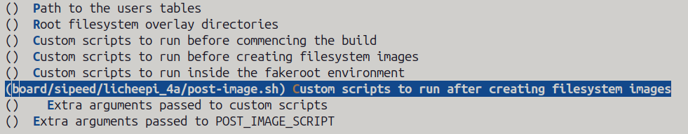

In my previous blog post, I wrote about how I got the latest buildroot working on
LicheePi 4a. In this post, lets dive deep into how you can add support for newer boards
and upstream the patches.

I am assuming that you already have an idea about What is Buildroot? and How it works? So,
lets directly jump into finding how to add support for newer boards.

## Generating board's defconfig

I will be referring to the LicheePi 4A BSP for supporting the examples.

First off, for writing the board's defconfig you need to know a few things

- Architecture
- Kernel version, tree and defconfig
- Device Tree Source (DTS) file name
- Uboot version, tree and defconfig
- OpenSBI version and tree (if required)
- Additional packages/binaries required for booting

> **NOTE**
> The attempt in buildroot is to prefer mainline trees as compared to the forks.

Recently a lot of patches got upstreamed for TH1520 SoC, so we are free to use the
mainline linux kernel tree for the minimal image. GPU/NPU drivers are still a work in
progress and need to use the downstream vendor's kernel for it.

For this BSP, I used the latest mainline kernel (v6.12) and vendor's Uboot (v2020.01) and
OpenSBI (v0.9) as these are yet to be upstreamed.

While generating the .config file via menuconfig, we need to select the kernel versions
along with the defconfig and Device Tree Source file name.


If you need to add some patches which are not there in the mainline kernel, you can add
them by adding the `BR2_LINUX_KERNEL_PATCH` variable.

Similarly, we configure the OpenSBI and Uboot settings. When adding the board, we need to
fix the repository version to a certain tag or commit hash. LicheePi 4a, requires the SPL
uboot image.




Now our major part of the configuration is complete, now we will configure how these
artefacts get installed and final image is generated.

> **NOTE**
> LicheePi 4A has 3 partitions namely uboot, boot and root these are for
> the uboot SPL image, boot partition boot.ext4 and root partiton for rootfs.ext4.

To generate the ext4 filesystem we select the ext4 option from the filessytem images
configuration tab.

Buildroot requires you to verify the hashes of all the files which it downloads while
building the image. For this you need to create a global patch and hash directory which
is usually inside your board's directory. For me I created the directory as follows
`board/sipeed/licheepi_4a/patches` this should have the hashes for linux, linux-headers,
uboot, opensbi and any other packages which you need.

If you need to run some scripts at any stage of the build you can speficy them from
the System Configruation settings. As in my case, I needed to run a script after creating
the filesystem images.



Buildroot uses `genimage.cfg` which contains the output image layout that genimage utility
uses to create the final image. Genimage is a tool used for generating multiple filesystem
images. You can find more [here](https://github.com/pengutronix/genimage). You have to add
your genimage configuration file in the boards directory as per the partition layout.

For saving your defconfig you can run the command `make savedefconfig BR2_DEFCONFIG=name`
this is your final defconfig, which can be used for building the image for your target.

Along with these configurations you need to add the board documentation as well. The
documentation is in the [asciidoc](https://asciidoc-py.github.io/) format.

While building the defconfig you should keep in mind that, you should only select the
packages which are absolutely required for the board to boot and function properly.

Once, you get your new board working on buildroot, you should first do a build against
the gitlab-CI docker container before sending the patches. You can start the docker
container via `utils/docker-run`.

## Adding custom packages

You might come to a point where, there are a few extra packages needed for the board to
boot or function properly which are not a part of buildroot target packages. For me, there
were a few binaries which were required to be added to the boot partition for the board to
boot further. We can't just add them in the boards directory and add them to the commits.
You need to add such binaries in a separate package and select the package in the
board's defconfig.

To create a package, I created a directory named `sipeed-lpi4abin` and added the required
files.

Every package consists of the following files

- Config.in: It contains the option descriptions for our package and displayed in the
    configuration tool.
- .mk: It describes how the package should be built and installed, etc.
- .hash: It contains the hash of the downloaded files for our package.

Once the package is ready you need to add the location of the newly created package's
`Config.in` file to the `package/Config.in` file.

## DEVELOPERS file

You should add yourself to the DEVELOPERS file as the maintainer for the specific package
or board's defconfig so that you will be mailed whenever there is a patch being sent which
modifies your package or defconfig.

## Upstreaming our work

Before you start sending out to the mailing list... Mailing List?
Yes, Buildroot also accepts contribution via the mailing list, just like the Linux Kernel.

You should create a really good commit message and it should explain what the commit is
doing. The commits should be atomic. In my case, I added a package for the bins and the
defconfig, I needed to create separate commits such that the package was added first then
the board's defconfig as the board's defconfig depended on the package. You should have
a signed off commit.

There are a few more guidelines regarding commit listed in the [official docs](https://buildroot.org/downloads/manual/manual.html#submitting-patches).

### Generating the patch series

Before generating the patch, you should first rebase your changes on top of the upstream
tree, and check the coding style for your changes via the docker container

``` Shell
utils/docker-run make check-package
```

You should fix any errors and warnings before sending the patches out to the mailing list.

Once all the errors and warnings are gone, you can generate the patches via

``` Shell
git format-patch -M -n -s -o outgoing origin/master
```

> **NOTE**
> If you need to create a coverletter as in my case, you can do so by supplying
> the `--cover-letter` option to the `git format-patch` command.

This will create the patches in the `outgoing/` directory. You can now send these
patches to the maintainer by running the output of the following command

``` Shell
./utils/get-developers outgoing/*
```

You should have git send-email installed on your host. You can monitor the feedback from
the maintainers and revision the patch as per the feedback according to these [guidelines](https://buildroot.org/downloads/manual/manual.html#_patch_revision_changelog).

The buildroot mailing list archive is at <https://lore.kernel.org/buildroot>.

## References

Here are a few references from the buildroot documentation

- [Buildroot Manual](https://buildroot.org/downloads/manual/manual.html)
- [Buildroot Developer Guide](https://buildroot.org/downloads/manual/manual.html#_developer_guide)
- [Add board in buildroot](https://buildroot.org/downloads/manual/manual.html#adding-board-support)
- [Add new packages to buildroot](https://buildroot.org/downloads/manual/manual.html#adding-packages)
- [LicheePi 4A commits](https://github.com/kanakshilledar/buildroot/tree/licheepi_4a_major)

Congratulations! You have finally contributed to buildroot!

Thanks for reading!
